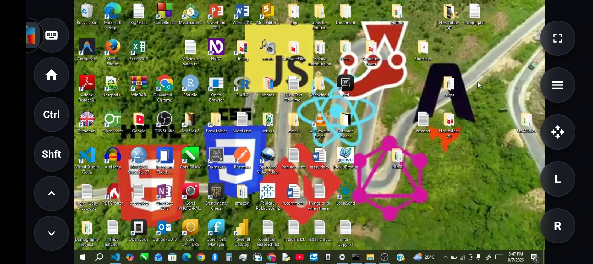

# mouse-- 🖱️📱

**A lightweight, zero-install Node.js tool that instantly turns your phone into a powerful, low-latency remote control for your PC.**

Built with Express, Socket.io, WebRTC, and `nut.js`, **mouse--** provides absolute mouse tracking, OS-level keyboard shortcuts (Ctrl/Shift), and two‑way text transfer without needing a native mobile app.



---

## ✨ Features

- **Low‑Latency Video** – Seamless WebRTC screen streaming directly to your mobile browser.
- **Absolute Mouse Control** – Precision touch tracking, dragging, left/right clicks, and scrolling.
- **Power‑User Keyboard** – Mobile native typing, a responsive D‑Pad, and sticky modifiers for shortcuts (Ctrl+C, Shift+Click).
- **Two‑Way Text Transfer** – A secure bridge to manually send links, code snippets, and text between devices.
- **Local Network Security** – Fully offline capable and protected by an auto‑generated 8‑digit pairing PIN.
- **Zero Install** – No mobile app required; just open a URL in your phone’s browser.

---

## 🧱 Architecture & Tech Stack

The system consists of three components:

| Component | Description | Technologies |
|-----------|-------------|--------------|
| **Node.js Server** | Orchestrates signaling, serves static files, and controls the host PC. | Express, Socket.io, `@nut-tree-fork/nut-js`, native `os` module |
| **Host Interface** (`host.html`) | WebRTC stream source; also hosts the PC side of the text bridge. | WebRTC (`getDisplayMedia`), vanilla JS |
| **Client Interface** (`client.html`) | Mobile controller that renders the stream and sends input events. | WebRTC, touch events, hidden textarea for keyboard capture |

---

## 🚀 Getting Started (Local Development)

### Prerequisites

1. **Node.js** (v18 or higher) installed on your computer.
2. **pnpm** installed:
  ```bash
   npm install -g pnpm
```

3. Your host PC and mobile phone must be on the same Wi‑Fi network.

Installation

1. Clone the repository:
   ```bash
   git clone https://github.com/Webkingif/mouse--.git
   cd mouse--
   ```
2. Install dependencies:
   ```bash
   pnpm install
   ```
3. Start the server:
   ```bash
   pnpm start
   ```
   Or directly:
   ```bash
   node server.js
   ```

---

🖥️ Host Setup – Sharing Your Screen

Browsers require manual approval for screen sharing. After the server is running:

1. On the host PC, open a browser and go to:
   ```
   http://localhost:3000/host
   ```
2. Click the “Initialize Stream” button.
3. In the browser’s native screen‑sharing dialog, select Entire Screen (or a specific monitor) and click Share.

Your screen is now ready to be streamed to your phone.

---

📱 Connecting Your Phone

When the server starts, the terminal will display the local network URL and a 8‑digit pairing PIN.

1. On your phone, open Safari or Chrome and navigate to the URL shown in the terminal, e.g.:
   ```
   http://192.168.1.15:3000/client
   ```
2. You’ll see an authentication panel. Enter the 8‑digit PIN (also visible on the host page).
3. Tap Connect.

🎉 The WebRTC stream will appear instantly, and the mobile control UI—including menu drawer, toolbars, and D‑Pad—will become available.

---

🎮 Control Mechanics

Mouse Tracking

· Absolute Mode (Default)
    Touch anywhere on the video; the PC cursor jumps to the corresponding absolute position on the screen.
    Ideal for quick navigation and precise clicks.
· Relative Drag Mode
    Toggle via the cyan button in the right toolbar. It mimics a laptop trackpad: dragging your finger moves the cursor by the same relative distance.
    Perfect for dragging windows or selecting text.
· Scrolling
    Dedicated scroll up/down buttons (left toolbar) continuously scroll while held.
· Clicks
    Instant left and right click buttons are always visible on the right toolbar.

Keyboard Emulation

· Native Mobile Keyboard
    Tapping the keyboard icon summons your phone’s built‑in keyboard. Input is captured via a hidden textarea and transmitted to the host.
  · autocapitalize="none", autocorrect="off", autocomplete="off" prevent unwanted modifiers.
  · Special handling for Backspace and Enter keys.
· Sticky Modifiers
    Dedicated Ctrl and Shift buttons toggle the modifier key state. While active, they hold the key down on the host until tapped again.
· D‑Pad
    A four‑way directional pad for fine cursor or text navigation (accessible from the left toolbar).

Two‑Way Text Transfer

Because browsers restrict background clipboard access, mouse-- includes a manual text bridge:

1. On the phone, open the side‑drawer menu and tap Text Transfer.
2. Type or paste text and send it to the PC. The host will receive it in the host web interface.
3. On the PC, you can also send text back to the phone.
4. Both sides have a Copy button to place the received text into the local clipboard.

A red notification dot appears on the menu button when a new message arrives.

---

🔒 Security & Handshake

· Local‑Only – The server listens on your LAN only, not the public internet.
· PIN Authentication – An 8‑digit PIN is generated at startup and must be entered by the client before any UI appears.
· WebRTC Encryption – The video stream is encrypted end‑to‑end (DTLS‑SRTP) between host and client.
· Host Approval – The host must explicitly click “Initialize Stream” to allow screen capture.

---

🗺️ Roadmap

· Publish as an NPM package for one‑command usage: npx mouse--
· Support for multiple monitors selection
· File transfer (drag‑and‑drop from phone to PC)
· Gamepad / controller emulation
· Audio forwarding (listen to PC audio on phone)

---

🤝 Contributing

Contributions are welcome! Please fork the repository and open a pull request. For major changes, open an issue first to discuss what you would like to change.

---

---

Enjoy controlling your PC from anywhere in the room!

